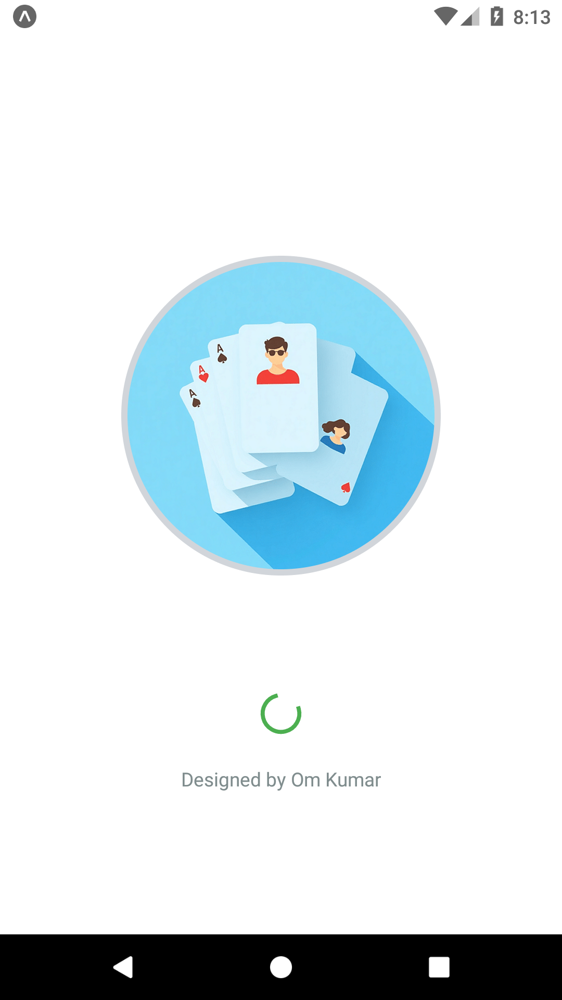
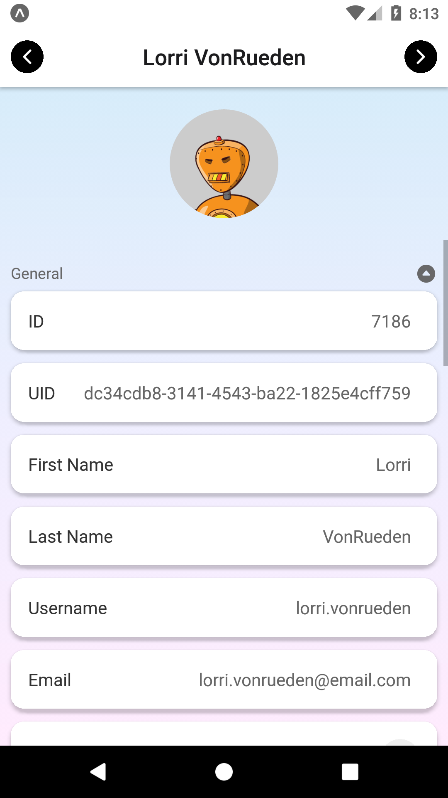
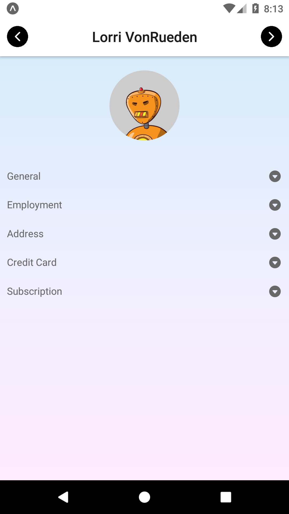

# UserDeck

UserDeck is a simple React Native application that displays user information fetched from the [Random Data API](https://random-data-api.com/). The app allows users to navigate between 80 different user profiles using "Previous" and "Next" buttons.

## Features

- Fetches user data from the Random Data API.
- Displays user information including:
  - ID
  - UID
  - Password
  - First Name
  - Last Name
  - Username
  - Email
  - Avatar (user image)
- Navigation buttons to switch between users.
- Clean and responsive user interface.

## Screenshots





## Technologies Used

- **React Native**: For building the mobile app.
- **React Navigation**: For handling navigation between screens.
- **Axios**: For making API requests.
- **Expo Vector Icons**: For icons.
- **Expo Linear Gradient**: For styling the app.

## How to Run the App Locally

Follow these steps to run the app on your local machine:

### Prerequisites

- Node.js and npm installed.
- Expo CLI installed globally (npm install -g expo-cli).
- A mobile device or emulator to run the app.

### Steps

1. **Clone the repository**:

```bash
git clone https://github.com/RaidenOM/UserDeck.git
cd UserDeck
```

2. **Install dependencies**:

```bash
npm install
```

3. **Start the development server**:

```bash
expo start
```

4. **Run the app**:

- Use the Expo Go app on your mobile device to scan the QR code displayed in the terminal.
- Alternatively, use an Android/iOS emulator to run the app.

## Project Structure

```
user-information-app/
├── assets/                # Contains static assets like images
├── components/            # Reusable components (e.g., Field, Seperator)
├── screens/               # App screens (e.g., UserDetails)
├── store/                 # Context and state management (e.g., AppContext)
├── App.js                 # Main entry point of the app
├── README.md              # Project documentation
└── package.json           # Project dependencies
```

## Additional Notes

- The app fetches 80 users at once to minimize API calls.
- Navigation buttons are disabled when the user reaches the first or last profile.
- The app is optimized for performance and usability.
